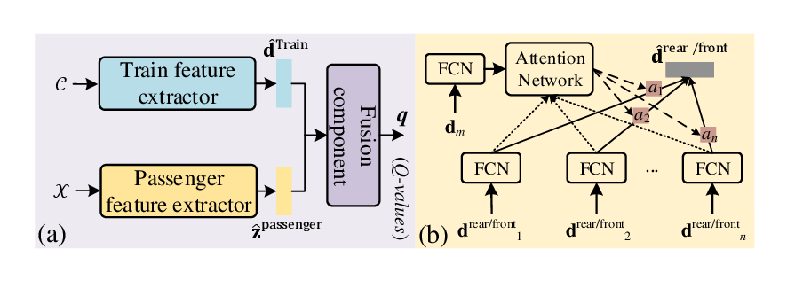
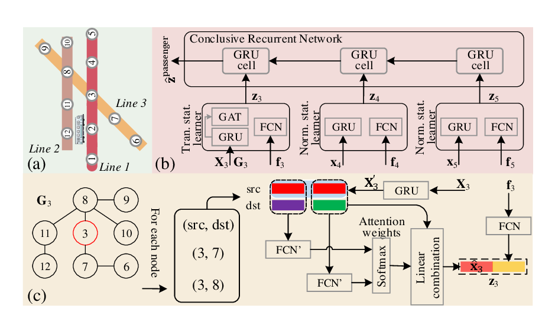

# AutoDwell

**AutoDwell** is a deep reinforcement learning framework that aims to study dynamic strategies to assign dwell time for trains in a metro system.  

It can properly assign the dwell time to each train for its next station to optimizes the long-term rewards of dwell time assigning in terms of passengers’ waiting time on platforms and the journey time on trains

## Structure

Concretely, it consists of three components: 

1. a *train feature extractor* to capture interactions between the current train and other trains on the same line based on the train state C.
2. a *passenger feature extractor* for embedding the upcoming passenger’ information among the passenger state X by considering and weighing the ST correlations among all these subsequent stations of the train.
3. a *fusion network* to fuse the two parts of knowledge and accordingly provide Q-values for actions.

Figure 1 (a) and (b) show the architecture of the framework and the train feature extractor, respectively.

*Figure 1  (a) Overview of AutoDwell; (b) Structure of the train feature extractor*

Figure 2 shows the Component 2 and 3, which are the passenger feature extractor and transfer station learner.

Figure 4: (a) An example of metro system. (b) Overview of the passenger feature extractor; (c) Structure of the transfer station learner.

## <!--Reference-->

<!--*Zhaoyuan Wang, Zheyi Pan. 2020. Shortening passengers’ travel time: A novel dynamic metro train.*-->

## <!--Author-->

<!--*Zhaoyuan Wang*-->

